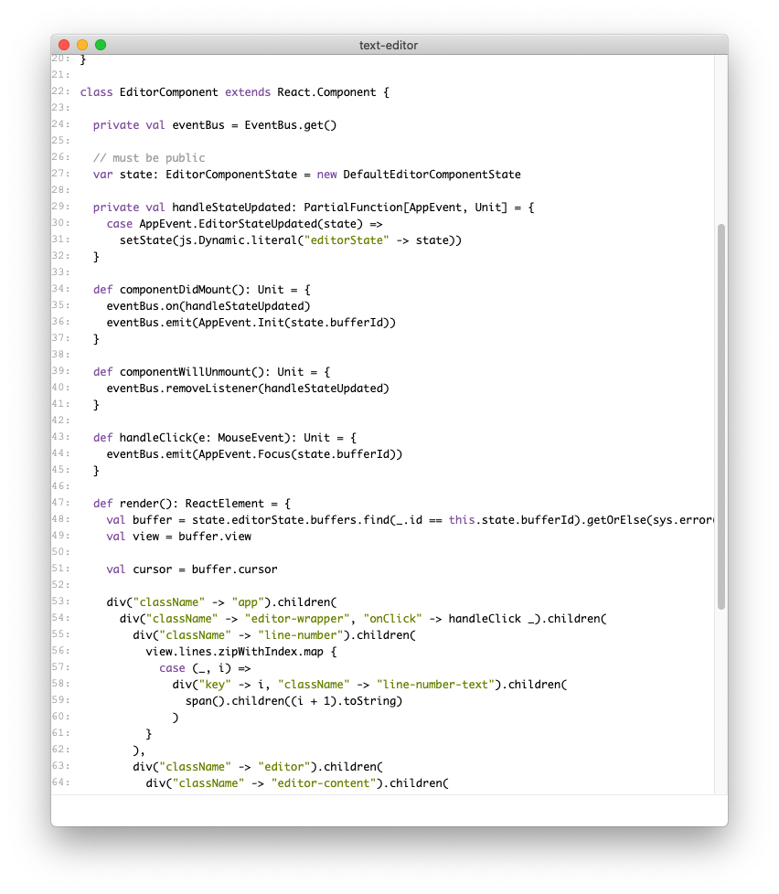

# scala-js-electron-text-editor

This is a toy text editor I made when I had some free time due to the Covid-19 emergency declaration (2020/04-05).
It is implemented in Scala.js+React+Electron.

Note:
 - I've only checked it in my environment (Mac+Mac's default IME), so it may not work well in other environments.
 - There are still many bugs and unimplemented things.



# How to build

```
$ npm install
$ make start
```
